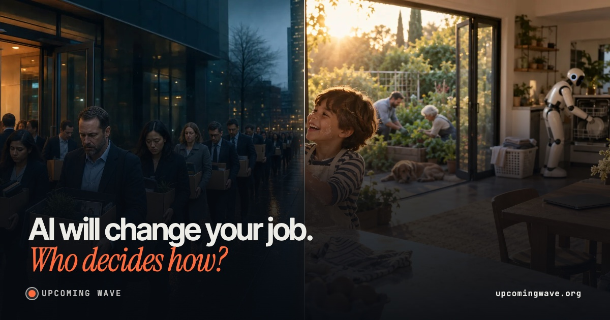

# Upcoming Wave



**[upcomingwave.org](https://upcomingwave.org)** · [Polski](https://upcomingwave.org/pl/) · [Español](https://upcomingwave.org/es/) · [Português](https://upcomingwave.org/pt/) · [Deutsch](https://upcomingwave.org/de/) · [Français](https://upcomingwave.org/fr/) · [日本語](https://upcomingwave.org/ja/)

A short, image-driven explainer of what AI could do to work, money and power, what goes right if we set good rules, and why the people building it are asking to be regulated. It's written for people who don't follow AI.

- **Balanced, not doom:** every risk chapter ends with "If we get it right".
- **Sourced:** every number and quote links to its source. The [Sources & method](https://upcomingwave.org/sources/) page lists all of them.
- **Short by default:** each chapter shows a title and photos; the facts open with "Read more", and each photo opens a step-by-step "Why?" slider.
- **Independent and non-commercial:** no ads, no sign-up. Analytics load only after consent.

> Inspired by *The Coming Wave* by Mustafa Suleyman and Michael Bhaskar (2023). Not affiliated with the authors or the publisher.

## The page

1. **Hero:** the same wave in two futures, with a before/after slider, and why this matters now (the July 2026 OpenAI test incident).
2. **Voices:** the CAIS statement, Hassabis, Altman and Gates first; Hinton, Amodei, the FLI letter and Suleyman behind "+ more voices".
3. **The stakes** (what AI could fix), then **four chapters:** Work · Money & the state · Speed & control · Who decides. Each chapter pairs a risk with its upside ("If we get it right").
4. **Rules**, then **What you can do**.

English is the default (`/`). Polish, Spanish, Portuguese (Brazil), German, French and Japanese live under `/pl/`, `/es/`, `/pt/`, `/de/`, `/fr/` and `/ja/`. On the first visit, browsers are redirected to the first supported language they prefer, and a choice made in the language menu is remembered.

## Tech

- [Next.js 15](https://nextjs.org) App Router with **static export** (`output: 'export'`). The build is plain HTML, CSS and JS in `out/` and needs no server.
- React 19, TypeScript, plain CSS (no UI framework), `zod` for env validation.
- Root layouts: `src/app/(en)` for English and `src/app/(intl)/[locale]` for every other language, statically generated. Each has its own `lang`, metadata, hreflang and JSON-LD.
- Photos: WebP in two widths plus `srcset`. They were generated for this project with OpenAI image models.

## Getting started

```bash
npm install
npm run dev            # http://localhost:3000
```

| Script | What it does |
|---|---|
| `npm run dev` | Dev server, including the unpublished archive at `/archive/` |
| `npm run build` | Clean static export to `out/` |
| `npm run build:verify` | Same build in a copy under `/tmp` (output in `/tmp/upcoming-wave-verify/out`), safe to run next to `dev` |
| `npm start` | Serve `out/` locally |
| `npm run lint` | ESLint (typescript-eslint, import order, feature boundaries) |

### Environment

Copy `.env.example` to `.env.local` if you need to override the defaults.

| Variable | Default | Purpose |
|---|---|---|
| `NEXT_PUBLIC_SITE_URL` | `https://upcomingwave.org` | Canonical URLs, sitemap, Open Graph |
| `NEXT_PUBLIC_GA_ID` | — | GA4 measurement ID. If empty, analytics are off. |

## Project structure

```
src/
  app/                    routes, layouts, metadata, sitemap, robots, 404
    (en)/  (intl)/[locale]/   English at /, other languages under /<code>/
  features/
    upcomingWave/
      components/         one folder per component (+ .types.ts)
      content/<locale>/   all copy, facts and sources, per language (en pl es pt de fr ja)
      content/archive/    frozen pre-restructure copy (dev-only /archive/)
      hooks/ context/ utils/ lib/ types/
    analytics/            GA4, loaded only after consent
  routes/locales.ts       the list of languages
  routes/paths.ts         every URL in one place
  styles/                 plain CSS, one file per area
public/
  images/v2/              photos (WebP, 1600 + 640 px)
  og/                     link-preview cards, one per language (versioned file names)
  _headers                caching + security headers (Cloudflare Pages / Netlify)
scripts/og-cards.py       regenerates the link-preview cards
```

### Editing content

All text lives in `src/features/upcomingWave/content/{en,pl}/`:

- `hero.ts`, `voices.ts`, `scenes.ts` (the chapters and their "If we get it right" strips), `closing.ts`, `ui.ts` (labels);
- `story.ts` sets the order of sections, `chain.ts` the progress bar in the header;
- every fact carries a `source: { label, url? }`. The small source captions and the Sources page are generated from these fields. A source without a URL, such as the book, links to its entry on the Sources page.

**Adding a language:**
1. Add the code to `LOCALES` and `LOCALE_INFO` in `src/routes/locales.ts`. Routes, hreflang, the sitemap, the language menu and the browser-language redirect all follow from this list.
2. Copy `content/en/` to `content/<code>/`, fix its imports, set `ui.lang`, translate the strings, and register it in `content/locales.ts`.
3. Generate its link-preview card with `python3 scripts/og-cards.py` (see the script header).

## Deploy

The site is a static folder, so any static host works. Production runs on **Cloudflare Workers** (static assets only, configured in `wrangler.jsonc`). Workers serve `out/`, apply `public/_headers`, and use `404.html` for unknown paths.

1. Cloudflare → Compute → Workers & Pages → Create → import the GitHub repo.
2. Build command: `npm run build`. Deploy command: `npx wrangler deploy`.
3. Production values (`NEXT_PUBLIC_SITE_URL`, `NEXT_PUBLIC_GA_ID`) come from `.env.production`, and the Node version from `.node-version`, so no dashboard variables are needed.
4. Worker → Settings → Domains & Routes → add `upcomingwave.org` and `www.upcomingwave.org`.
5. Add the domain in Google Search Console and submit `/sitemap.xml`. Import it into Bing Webmaster Tools.

Every push to `main` redeploys automatically.

## Contributing

Fixes, better sources, translations and design improvements are welcome. Fork the repo, make your change, and open a pull request against `main`. Before you do:

- run `npm run lint` and `npm run build:verify`;
- make sure every new fact has a `source` with a link;
- keep code, comments and commit messages in English. Only `content/<locale>/` holds translated copy.

## Corrections

Spotted a wrong number, a misquote or a broken source? Open an issue or write to [@blyzbyte](https://x.com/blyzbyte) on X. Corrections are fixed quickly and the Sources page is updated.

## License

Source-available, **not** open source: see [LICENSE](LICENSE). You may fork and modify the code to contribute back through pull requests. You may not deploy, host or redistribute the site or modified versions of it without permission.

## Author

Made by [@blyzbyte](https://x.com/blyzbyte).
